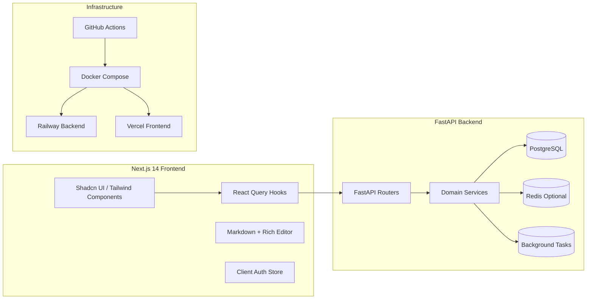
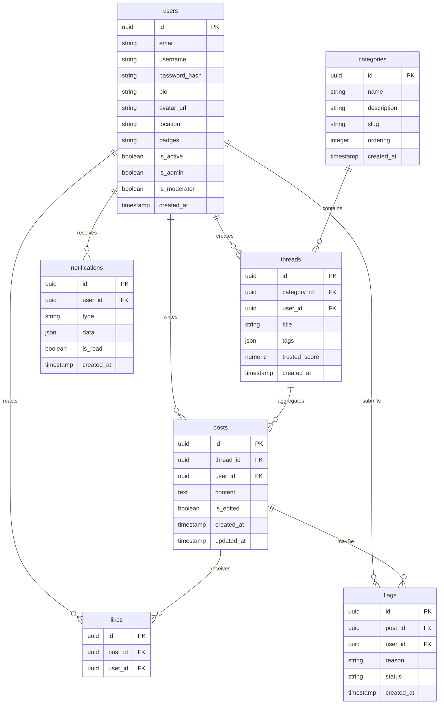

# East Dulwich Forum — System Architecture

This document captures the initial system design that underpins the East Dulwich Forum rebuild. It outlines the architecture, core data models, and deployment approach agreed upon before implementation.

## 1. High-Level Goals
- Deliver a modern, community-first platform with category → thread → post hierarchy.
- Provide trustable local recommendations, moderation, and notifications.
- Support FastAPI backend, JWT authentication, and PostgreSQL as requested.
- Optimize for cloud deployment (Railway for backend, Vercel for frontend) with container support.

## 2. System Context
```mermaid
C4Context
    title System Context
    Person(user, "Community Member")
    Person(moderator, "Moderator", "Elevated privileges")
    Person(admin, "Admin", "Manages platform & flags")
    System_Ext(email, "Email Provider", "Transactional email delivery")
    System_Ext(mapbox, "Map/Geocoding APIs", "Map tiles + location search")
    System_Ext(authProvider, "Social OAuth Providers", "Optional social sign-in")
    System(system, "East Dulwich Forum", "Web + API")
    user -> system: Browse, create posts, receive notifications
    moderator -> system: Review flags, ban/unban users
    admin -> system: Configure categories, manage recommendations
    system -> email: Send notification digests, alerts
    system -> mapbox: Render local maps, geocode addresses
    system -> authProvider: Optional OAuth flows
```

## 3. Logical Architecture


## 4. Folder Structure (Top Level)
```
/frontend              # Next.js application
/backend               # FastAPI application
/docs                  # Architecture, ADRs, API references
/infrastructure        # Deployment, Docker, compose, IaC
/scripts               # Helper scripts (bootstrap, seeding)
/.github/workflows     # CI/CD automation
```

Sub-folder highlights:
- `frontend/app` (App Router pages, layouts, API routes)
- `frontend/components` (Shadcn primitives, feature components)
- `frontend/lib` (API client, auth helpers)
- `backend/app/api/routes` (versioned routers)
- `backend/app/services` (business logic)
- `backend/app/models` + `schemas` (SQLAlchemy + Pydantic)
- `infrastructure/docker-compose.yml` (local dev stack)

## 5. Data Models


## 6. API & Service Layer
- **Auth Service**: registration, login, JWT issuance, password reset.
- **User Service**: profile updates, badge assignment, ban/unban, activity feed.
- **Forum Service**: CRUD for categories, threads, posts, likes.
- **Moderation Service**: flag triage, user suspension, post removal.
- **Notification Service**: event hooks → DB notifications → email queue.
- **Search Service**: PostgreSQL full text for threads/posts, filters by category/user.

## 7. Deployment Strategy
- **Backend**: Containerized FastAPI deployed on Railway. Uses Gunicorn/Uvicorn workers, connects to managed PostgreSQL. Alembic migrations run via GitHub Actions job or Railway deploy hook.
- **Frontend**: Next.js deployed on Vercel with environment variables for API URL, map tokens, and analytics. Incremental Static Regeneration for marketing pages; dynamic server actions for forum content.
- **CI/CD**: GitHub Actions matrix pipeline
  - Lint/test backend (pytest, mypy, ruff placeholders).
  - Build frontend (pnpm lint, type-check) and export.
  - On main branch, build/push Docker images + deploy triggers.
- **Local Dev**: `docker-compose` orchestrates FastAPI, Next.js, PostgreSQL, and Redis for rate limiting/notifications.

## 8. Security & Observability
- JWT auth with refresh rotation, hashed passwords via bcrypt.
- Role-based guards (user, moderator, admin).
- SlowAPI rate limiting, CORS config, Helmet-style headers via middleware.
- Structured logging (JSON) piped to Railway/Vercel logs.
- OpenTelemetry hooks (extensible) for tracing key routes.

## 9. Next Steps
1. Scaffold backend + frontend directories with the structure above.
2. Implement models, schemas, routers, and UI flows per feature list.
3. Configure Docker, CI/CD, and documentation.
4. Deploy to Railway/Vercel once QA passes.
